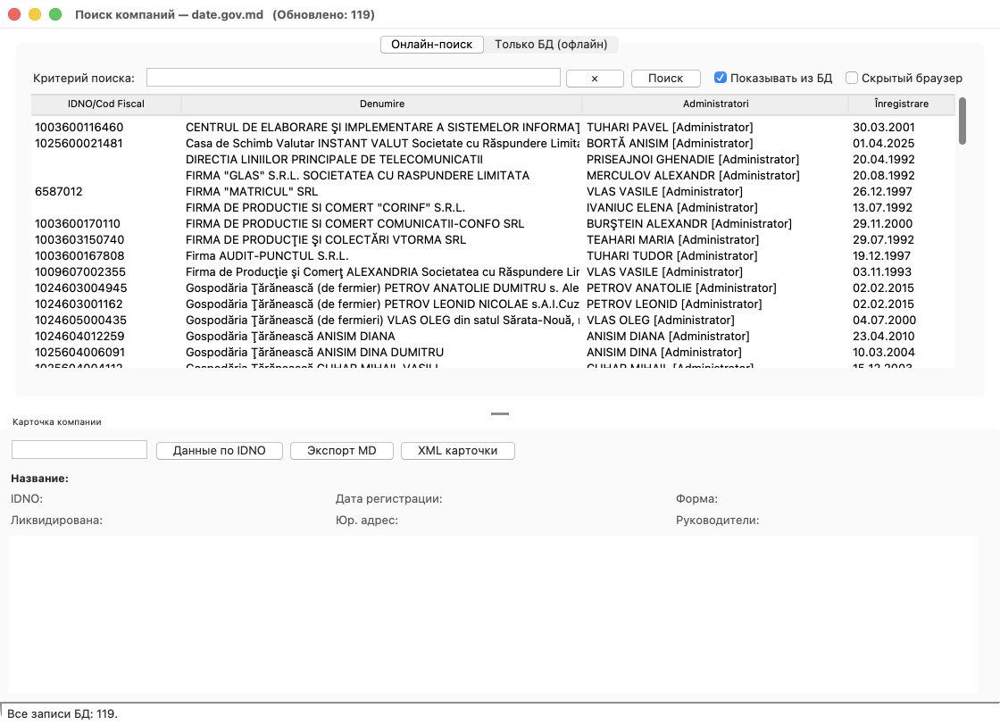
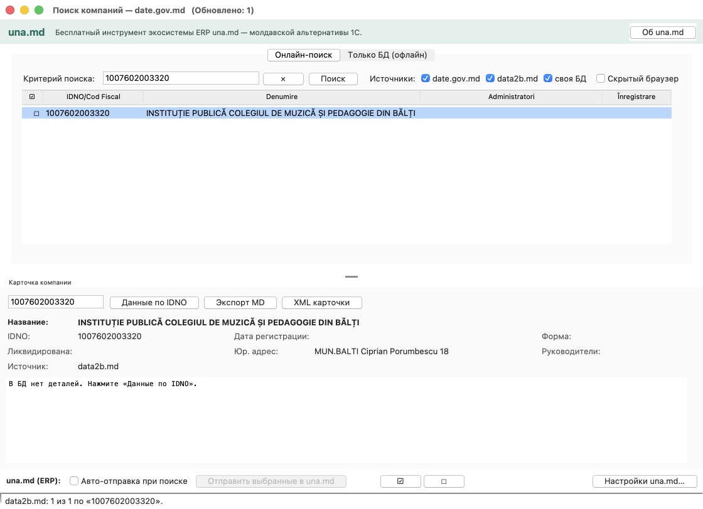
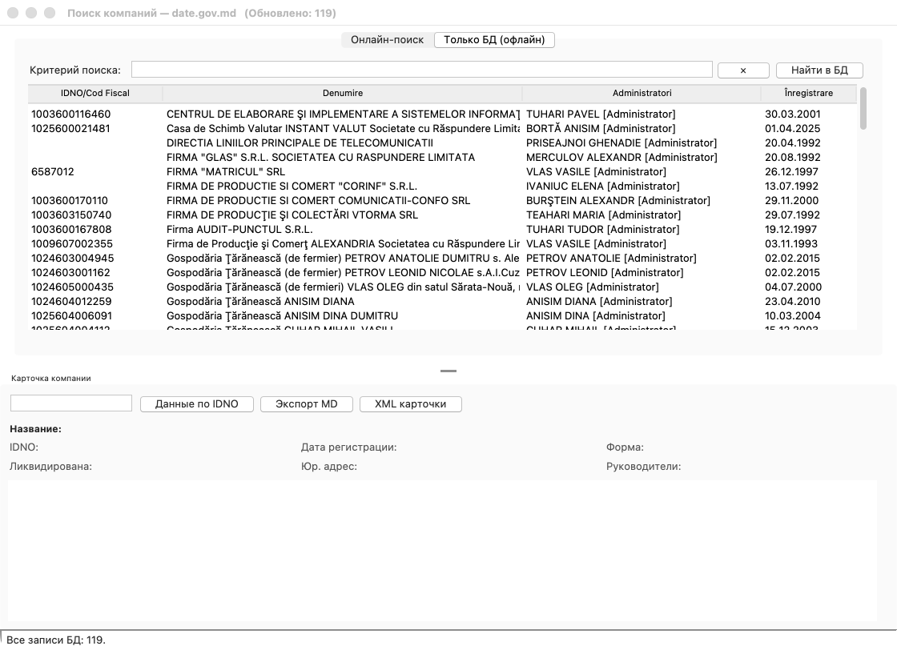
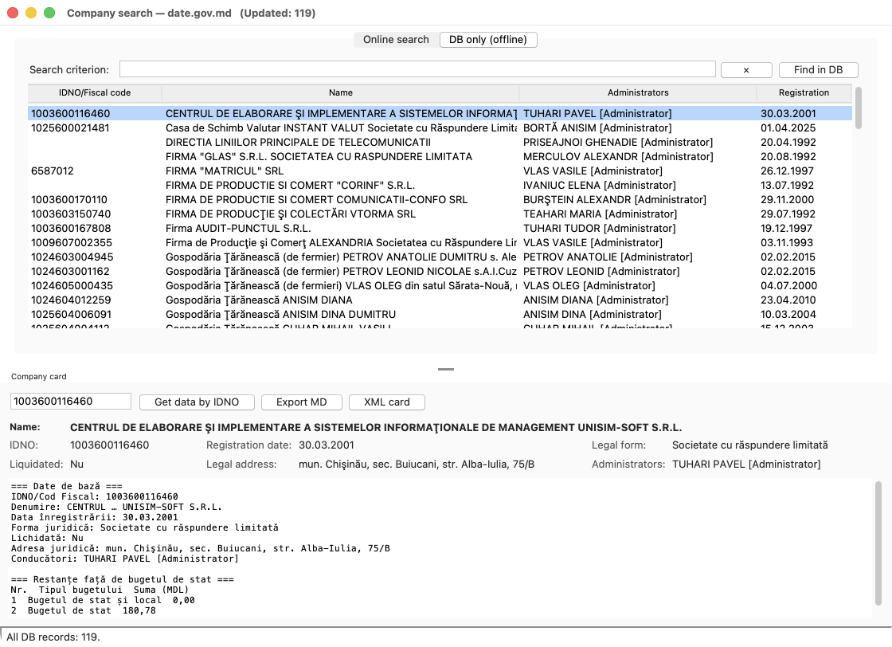
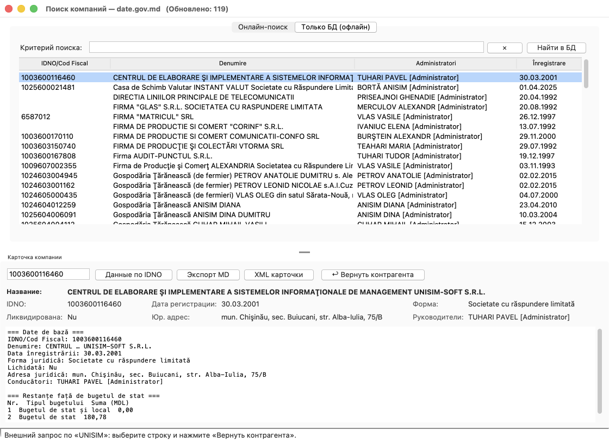
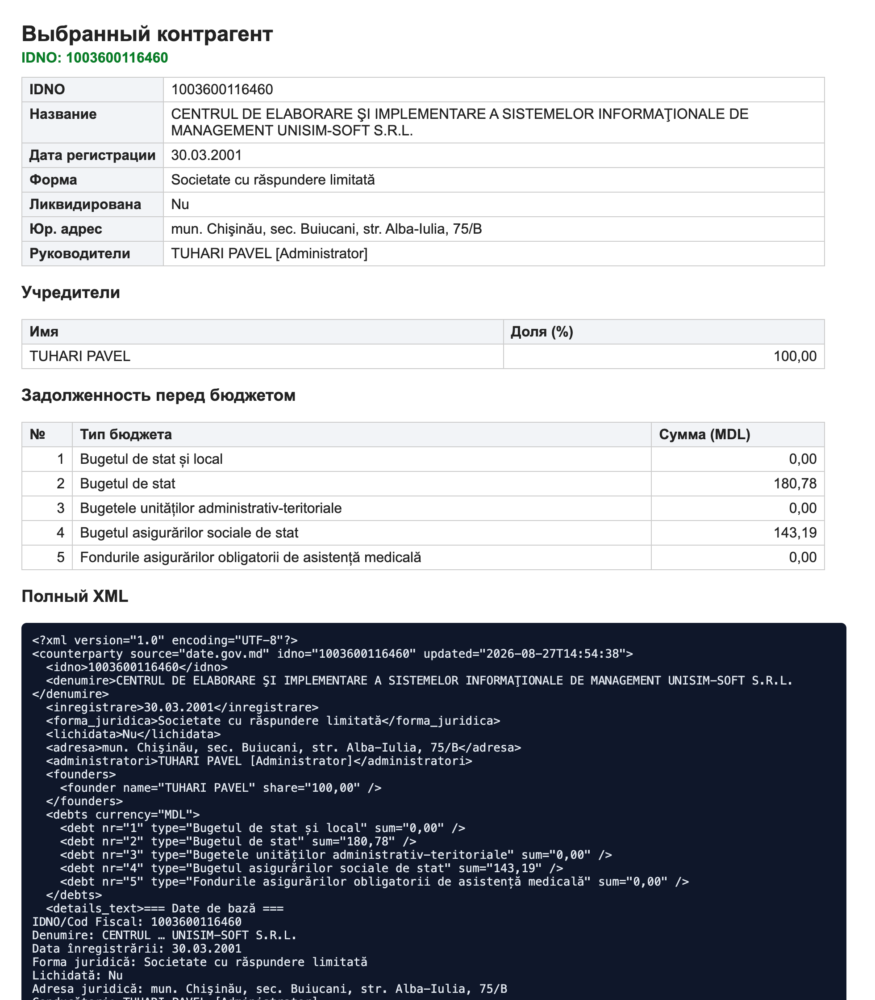

# Contragenti — инструкция пользователя (со скриншотами)

Пошаговое руководство по работе с утилитой поиска контрагентов на портале
открытых данных **date.gov.md**. Технические детали — в
[TECHNICAL_ru.md](TECHNICAL_ru.md), интеграция — в [API_ru.md](API_ru.md).

---

## Зачем нативное приложение, а не сайт или скрипт

Форма поиска на date.gov.md защищена **невидимой reCAPTCHA**. Это создаёт два
ограничения, которые и определяют архитектуру утилиты:

1. **Нужен реальный браузер.** Обычный серверный скрапер или запрос `curl`
   получают в ответ `HTTP 400` — портал не отдаёт данные без валидного токена
   капчи. Токен выдаётся только настоящему браузеру. Поэтому утилита —
   **нативное приложение**, которое запускает и автоматизирует реальный
   **Google Chrome** и проходит форму **так же, как это делает человек**:
   капча-невидимка проходит по поведенческой оценке Google, а если Google
   покажет проверку — её решает пользователь в открытом окне. Утилита **не
   взламывает** защиту, а работает с публичной формой штатным образом.

2. **Данные сразу попадают в базу.** Найденные записи и карточки
   **автоматически пишутся напрямую в локальную базу SQLite** (`companies.db`) —
   без копирования вручную, с накоплением между сеансами.

Отсюда и все признаки настольной программы: своё окно ОС, локальный файл базы,
доступ к буферу обмена, системный трей и встроенный локальный API для 1С.
Подробнее — в [NATIVE_ru.md](NATIVE_ru.md).

---

## Установка и запуск

```bash
git clone https://github.com/PavelTuhari/Contragenti.git
cd Contragenti
python3.12 -m venv .venv
./.venv/bin/python -m pip install -r requirements.txt
./run.sh
```

Требуется **Google Chrome**. На macOS (Homebrew) при ошибке `No module named
'_tkinter'` выполните `brew install python-tk@3.12`. Полная установка — в
[DOCUMENTATION_ru.md](DOCUMENTATION_ru.md).

> ⚠️ Не включайте флажок **«Скрытый браузер»**: в headless-режиме Google почти
> всегда требует ручную капчу, и запрос завершается по таймауту.

---

## 1. Онлайн-поиск

Вкладка **«Онлайн-поиск»** — стартовый экран. Введите название компании, имя
руководителя или IDNO и нажмите **«Поиск»**.



Что происходит по нажатию «Поиск»:

1. Открывается окно **Google Chrome**, утилита вписывает запрос в форму портала
   и отправляет её (проходит капча).
2. Результаты **автоматически сохраняются в SQLite** (upsert по IDNO: совпал —
   обновление, иначе вставка).
3. Таблица показывает выборку. Флажок **«Показывать из БД»** (по умолчанию
   включён) выводит накопленный результат из базы; **«×»** очищает поле и
   показывает **все** записи базы.

---

## 1a. Источники поиска

Рядом с полем поиска — переключатели **«Источники»**. Каждый включается и
отключается отдельно, а состояние **запоминается** между запусками
(файл `settings.json`):

| Источник | Что делает |
|---|---|
| **date.gov.md** | Портал открытых данных: полная карточка (форма, руководители, учредители, задолженность). Работает через окно Chrome, есть капча |
| **data2b.md** | Публичный справочник: название, IDNO, адрес. Обычный HTTP-запрос, без капчи, доли секунды |
| **своя БД** | Локальная база: показывать накопленные записи вместе со свежей выдачей |



На снимке: портал ответил «нет данных», а data2b.md нашёл компанию — в карточке
видно название, адрес и поле **«Источник: data2b.md»**.

Если отключить **оба онлайн-источника**, поиск идёт только по локальной базе —
мгновенно и без интернета.

### Почему нужен второй источник

На портале date.gov.md есть **не все** действующие компании. Пример — реальное
учреждение с IDNO `1007602003320`: портал по нему отвечает
«Rezultat căutare persoană juridică — **Nu sunt date.**»

При нажатии «Поиск» включённые источники опрашиваются **одновременно**:

- **date.gov.md** — через окно Chrome (капча), 10–30 секунд, полная карточка
  (форма, руководители, учредители, задолженность);
- **data2b.md** — обычным HTTP-запросом публичного поиска сайта, доли секунды,
  даёт название, IDNO и адрес.

Результаты объединяются и дедуплицируются по IDNO: если компания есть в обоих
источниках, запись одна, а данные дополняют друг друга (например, адрес из
data2b.md добавляется к карточке портала). Источник каждой записи виден в
карточке в поле **«Источник»**, попадает в экспорт и в XML.

Когда портал отвечает «Nu sunt date.», утилита понимает это **сразу**: закрывает
браузер и возвращает управление, не выжидая полный таймаут. Раньше такой поиск
впустую занимал около двух минут.

> Второй источник даёт только базовые поля. Учредители и задолженность есть
> лишь на портале — их подтягивает кнопка **«Данные по IDNO»**.
> Источники можно отключать флажками; `--no-data2b` отключает data2b.md
> из командной строки.

---

## 2. Вкладка «Только БД» (офлайн)

Мгновенный поиск по уже накопленной базе — **без обращения к сайту и без
капчи**. Пустой запрос показывает все записи (в заголовке окна — их количество).



---

## 3. Карточка компании (master-detail)

Выберите строку в таблице — снизу откроется **карточка** выбранной компании:
название, IDNO, дата регистрации, форма, признак ликвидации, юридический адрес,
руководители, а также текстовая область с полными данными (базовые сведения и
задолженность перед бюджетом).


Кнопки карточки:

- **«Данные по IDNO»** — запрашивает детальную карточку с сайта (учредители,
  задолженность) и **сохраняет её в базу**. Если детали уже есть в БД — берутся
  из базы, без обращения к сайту.
- **«Экспорт MD»** — сохранить карточку в Markdown (см. раздел 5).
- **«XML карточки»** — скопировать XML карточки в буфер обмена.

---

## 4. Три языка интерфейса

Меню **«Язык»** переключает интерфейс между **Русским / English / Română** на
лету — без перезапуска. Тот же экран на английском:



---

## 5. Экспорт данных

Меню **«Экспорт»**:

| Пункт | Результат |
|---|---|
| **Вся БД → CSV** | CSV (`;`, UTF-8 с BOM) — открывается в Excel |
| **Вся БД → Excel** | Файл `.xlsx` |
| **Выбранные → MD (папка)** | По одному `.md`-файлу на каждую выделенную строку (множественный выбор — Ctrl/Shift+клик) |
| **Текущую → MD** | Карточка текущей компании в Markdown |

Markdown содержит базовые поля, **отдельные таблицы учредителей и
задолженности** и блок полного текста — удобно передавать ИИ-системам.

---

## 6. Интеграция: возврат контрагента во внешнюю программу

Утилита поднимает локальный HTTP-API (по умолчанию `http://127.0.0.1:9393`).
Когда внешняя программа (1С, портал, CRM) **не нашла контрагента** по своему
фильтру, она вызывает:

```
http://127.0.0.1:9393/pick?q=<фильтр>&lang=ru
```

Утилита открывается с готовым поиском, и на карточке появляется заметная кнопка
**«↩ Вернуть контрагента»**. Пользователь выбирает нужную компанию и нажимает
её:



После нажатия вызвавшая сторона получает данные выбранного контрагента.
**Браузер** видит наглядную страницу с основными полями, таблицами учредителей и
задолженности и полным XML; **программа** (1С, `curl`, `fetch`) — чистый XML.



Дополнительно поддерживается **возврат пользователя обратно** в веб-систему:
`/pick?...&return_to=<URL>&state=<ид>` — после выбора браузер уходит на ваш
адрес с данными компании в query-строке. Полное описание, коды ответов и пример
кода на **1С (BSL)** — в [API_ru.md](API_ru.md).

---

## Частые вопросы

**Ничего не находится онлайн / долго крутится.** Проверьте, что открылось окно
Chrome и не появилась капча-картинка (если появилась — решите её). Не включайте
«Скрытый браузер».

**Как перезапустить программу?** Меню **«Файл → Перезапустить»**: утилита
корректно закрывает локальный сервер и трей и запускает себя заново с теми же
аргументами. Удобно после смены настроек или если что-то «подвисло».

**Как завершить программу?** Меню **«Файл → Выход»** или пункт **Quit** в трее.
Закрытие окна крестиком при работающем API сворачивает утилиту в фон.

**Где лежат данные?** В файле `companies.db` рядом с программой. Его можно
переносить между машинами.
