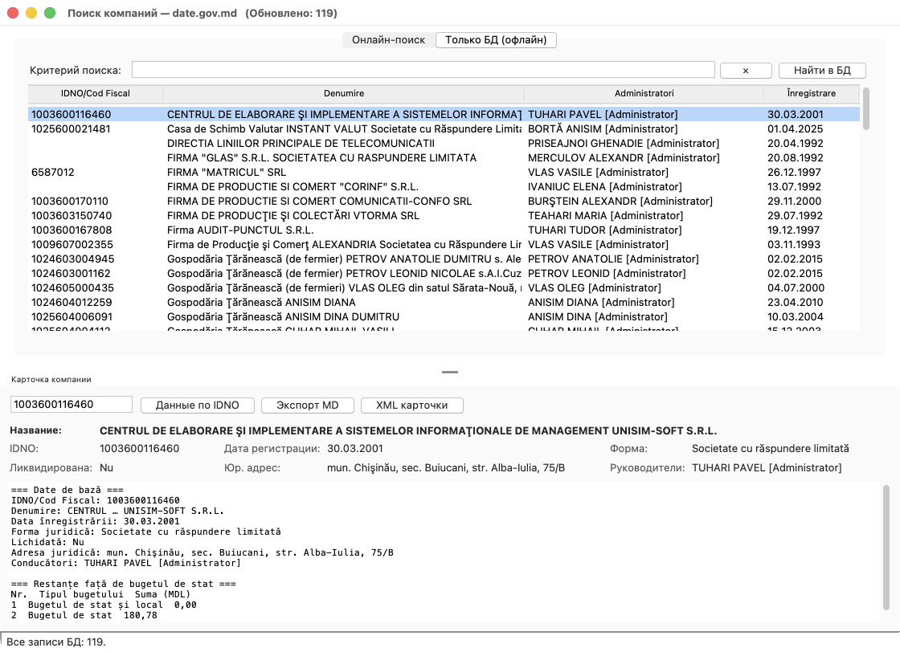

# Contragenti

**Бесплатный инструмент экосистемы [ERP una.md](https://una.md) — молдавской
альтернативы 1С.**

Нативная desktop-утилита для поиска юридических лиц Молдовы на портале открытых
данных **date.gov.md**, ведения локальной базы контрагентов и возврата карточки
контрагента во внешние системы (**1С**, браузер, любые нативные приложения)
в формате **XML**.

Найденный контрагент отправляется **прямо в справочник una.md** — тремя
связанными блоками (справочная запись, реквизиты, банковские счета), без
перенабора вручную и промежуточных CSV. Утилита сделана открытой намеренно:
это рабочий пример того, что даёт ERP, в которую можно писать из любой программы.




---

## Возможности

- 🔎 **Онлайн-поиск** компаний по названию / имени руководителя / IDNO.
- 📇 **Карточка компании** по IDNO: базовые данные, **учредители**,
  **задолженность перед бюджетом**.
- 💾 **Локальная база SQLite** — все результаты сохраняются автоматически
  (upsert по IDNO: совпал — `UPDATE`, иначе `INSERT`).
- 📴 **Офлайн-вкладка «Только БД»** — мгновенный поиск без обращения к сайту.
- 📤 **Экспорт**: вся база → CSV / Excel; компания → **Markdown** (для ИИ);
  массовый экспорт выбранных строк в отдельные `.md`-файлы.
- 🌍 **Три языка интерфейса**: English / Русский / Română — переключение на лету.
- 🔌 **Локальный HTTP-API** (порт по умолчанию `9393`) + иконка в системный трее
  для интеграции с 1С и другими программами.
- ↩ **Режим «выбор контрагента»**: внешняя программа передаёт фильтр, по которому
  не нашла контрагента → утилита открывается с готовым поиском → пользователь
  выбирает компанию → вызвавшая программа получает **XML полной карточки**.

---

## Почему это нативное приложение

**Причина №1 — reCAPTCHA портала.** Форма поиска date.gov.md защищена невидимой
reCAPTCHA: обычный серверный скрапер или `curl` получают `HTTP 400` без валидного
токена. Токен выдаётся только настоящему браузеру, поэтому утилита запускает и
автоматизирует реальный **Google Chrome** и проходит форму **как живой
пользователь** (капча-невидимка проходит сама, при проверке её решает человек).
Это не обход и не взлом защиты, а работа с публичной формой штатным способом.

**Причина №2 — прямая запись в базу.** Найденные записи и карточки
**автоматически сохраняются в локальную SQLite** (`companies.db`), без ручного
копирования и с накоплением между сеансами.

Отсюда и все свойства настольной программы: **код исполняется на компьютере
пользователя, окно рисует оконный менеджер ОС, данные лежат на локальном диске,
серверной части нет.** Подробный разбор с частыми возражениями — в
**[NATIVE_ru.md](NATIVE_ru.md)**.

| Признак | Contragenti |
|---|---|
| Где выполняется код | Локальный процесс ОС (`python`), не в браузерной песочнице |
| Интерфейс | Окно ОС на Tk/ttk (Cocoa на macOS, Win32 на Windows) |
| Хранение данных | Локальный файл `companies.db` (SQLite) на диске пользователя |
| Серверная часть | Отсутствует: нет backend, нет деплоя, нет аккаунтов |
| Интеграция с ОС | Системный трей, буфер обмена, диалоги файлов, запуск процессов |
| Работа офлайн | Да — вкладка «Только БД» полностью автономна |

> Встроенный HTTP-сервер на `127.0.0.1` — это **транспорт межпроцессного
> взаимодействия** (IPC) с 1С и браузером, а не веб-приложение: он никуда не
> публикуется и доступен только с этой машины. Точно так же управляемый Chrome —
> это внешний нативный процесс, используемый как «шлюз» к защищённому капчей
> сайту.

---

## Установка

**Требования:** macOS / Windows / Linux, **Python 3.12+** с поддержкой Tkinter,
установленный **Google Chrome**.

```bash
git clone https://github.com/PavelTuhari/Contragenti.git
cd Contragenti
python3.12 -m venv .venv
./.venv/bin/python -m pip install -r requirements.txt
```

> **macOS (Homebrew):** Tkinter ставится отдельным пакетом.
> Если при запуске появляется `ModuleNotFoundError: No module named '_tkinter'`,
> выполните `brew install python-tk@3.12`.

Драйвер Chrome загружается автоматически (Selenium Manager) — вручную ставить
`chromedriver` не нужно.

На **Windows** пошаговая установка утилиты **и** Demo CRM — в статье
**[INSTALL_WINDOWS_ru.md](INSTALL_WINDOWS_ru.md)**
([HTML](docs/ustanovka-demo-crm-windows.html)).

### Windows: MSI-установщик и мастер настройки

**Скачать установщик:**
[Contragenti-1.1.0-win64.msi](https://github.com/PavelTuhari/Contragenti/raw/main/release/Contragenti-1.1.0-win64.msi)
(≈40 МБ, папка [release/](release/)). Рядом — [Contragenti-update-1.1.0.zip](https://github.com/PavelTuhari/Contragenti/raw/main/release/Contragenti-update-1.1.0.zip):
пакет обновления поверх установки (Demo CRM, переводы, процессы, SDK,
инструкции, стартовая база); он пересобирается автоматически при каждой
компиляции Demo CRM и перед каждым коммитом (`tools/make_release.py`),
ссылки и sha256 — в [release.json](release.json).

Для чистого Windows без Git MSI (`python setup.py bdist_msi`
→ `dist/Contragenti-<версия>-win64.msi`, затем `python tools/make_release.py`
кладёт его в `release/`) ставит Contragenti.exe, Demo CRM и SDK, а в конце
запускает **мастер настройки** («Contragenti Setup.exe», он же в меню
«Пуск» — «Contragenti — настройка и обновление»):

- технический паспорт компьютера (ОС, память, Chrome, Python, версии файлов);
- если Python нет — ставит его по виду Windows: современный (10 с 1903 / 11)
  через `winget` или команду `python` (Microsoft Store, в одно касание),
  старый (8.1, ранние 10, без Store) — официальным установщиком с python.org
  с проверкой подписи; exe и Demo CRM работают и без Python;
- докачивает из этого репозитория свежие компоненты по `release.json`
  (Demo CRM, переводы `lang.json`, процессы `processes.json`, SDK) и
  стартовую базу компаний `data/companies_seed.zip`; если вышла новая
  версия MSI — предлагает скачать;
- настраивает `crm.ini`, язык в реестре, демо-данные, гоняет самопроверку;
- при ошибках сохраняет отчёт (паспорт + лог + события Windows Installer)
  и предлагает отправить его разработчику — issue на GitHub или письмо.

Подробно — [INSTALL_MSI_ru.md](INSTALL_MSI_ru.md) и раздел «Быстрый путь»
в [INSTALL_WINDOWS_ru.md](INSTALL_WINDOWS_ru.md).

---

## Запуск

```bash
./run.sh
```

или напрямую:

```bash
./.venv/bin/python company_search.py
```

### Аргументы командной строки

| Аргумент | По умолчанию | Назначение |
|---|---|---|
| `--port N` | `9393` | Порт локального HTTP-API |
| `--host H` | `127.0.0.1` | Адрес прослушивания API |
| `--lang ru\|ro\|en` | `ru` | Язык интерфейса при старте |
| `--q "ТЕКСТ"` | — | Стартовать сразу с этим поиском |
| `--pick` | выкл. | Одноразовый режим: дождаться выбора, вывести XML, выйти |
| `--out FILE` | — | Файл для записи XML (вместе с `--pick`) |
| `--no-server` | выкл. | Не запускать HTTP-API |
| `--no-tray` | выкл. | Не создавать иконку в трее |

---

## Быстрый старт интеграции

Открыть в браузере — утилита покажет окно с поиском, а после выбора вернёт
страницу с полями и полным XML:

```
http://127.0.0.1:9393/pick?q=UNISIM&lang=ru
```

Получить карточку из базы программно:

```bash
curl "http://127.0.0.1:9393/card?idno=1003600116460&format=xml"
```

Полное описание API и пример кода на **1С (BSL)** — в **[API_ru.md](API_ru.md)**.

---

## Документация

| Документ | Содержание |
|---|---|
| **[INSTALL_WINDOWS_ru.md](INSTALL_WINDOWS_ru.md)** | **Статья:** установка Demo CRM и утилиты карточек date.gov.md на Windows |
| **[INTEGRATION.md](INTEGRATION.md)** | **Единый гайд по интеграции** — CLI-контракт, формат XML, таблица соответствия полей, готовые SDK на Python/Delphi/C++ |
| **[GUIDE_ru.md](GUIDE_ru.md)** | Инструкция пользователя **со скриншотами** |
| **[DOCUMENTATION_ru.md](DOCUMENTATION_ru.md)** | Руководство пользователя: интерфейс, база, экспорт |
| **[API_ru.md](API_ru.md)** | Интеграция через HTTP: эндпоинты, XML-схема, примеры 1С / JS / curl |
| **[TECHNICAL_ru.md](TECHNICAL_ru.md)** | Техническая документация: архитектура, потоки, парсеры |
| **[NATIVE_ru.md](NATIVE_ru.md)** | Почему это нативное приложение |

## Интеграция и Demo CRM

Хочешь подключить поиск контрагентов к своему приложению (Delphi / Python /
C++ / 1С)? Один документ содержит всё необходимое — **[INTEGRATION.md](INTEGRATION.md)**.
Готовые обёртки вызова лежат в **[sdk/](sdk/)** (Python, C++) и
**[crm_delphi/uContragenti.pas](crm_delphi/uContragenti.pas)** (Delphi).

В качестве рабочего образца «от кнопки до строки в БД» в репозитории есть
**[crm_delphi/](crm_delphi/)** — demo-CRM на Delphi/VCL с интерфейсом в
стиле EspoCRM: своя SQLite-база клиентов, кнопка «Создать клиента» вызывает
Contragenti и сохраняет карточку с дедупликацией по IDNO. Она включена в
MSI-инсталлятор целиком (`setup.py`, каталог `DemoCRM/`) — после установки
на рабочем столе появляется отдельный ярлык «Demo CRM (SDK Contragenti)».

Пошаговая установка **обеих** программ на Windows (Python 3.12, Chrome, Demo CRM
из готового exe, `crm.ini`, первый контрагент с date.gov.md) —
в статье **[INSTALL_WINDOWS_ru.md](INSTALL_WINDOWS_ru.md)**
([HTML](docs/ustanovka-demo-crm-windows.html)).

---

## Важно про капчу

Страницы портала защищены **невидимой reCAPTCHA**, поэтому запросы к сайту
выполняются через реальное окно Chrome. Опцию **«Скрытый браузер»** (headless)
включать не следует: в этом режиме Google почти всегда требует ручную проверку,
и запрос завершается по таймауту.

---

## Лицензия

MIT — см. [LICENSE](LICENSE).

Данные предоставляются порталом открытых данных Правительства Республики
Молдова (date.gov.md). Утилита не обходит защиту сайта: она работает с
публичной формой так же, как обычный пользователь в браузере.
